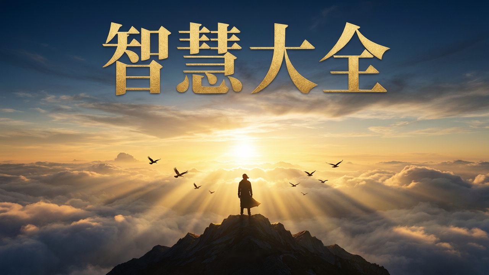

# 智慧大全 —— 从认识自我到超越自我

> 你活着不是为了满足别人的期待，而是发现并成为真正的自己。

**[中文](README.md)** · **[English](README_en.md)** · **[日本語](README_ja.md)** · **[한국어](README_ko.md)** · **[Français](README_fr.md)** · **[Español](README_es.md)** · **[Deutsch](README_de.md)**

---

## 书籍封面

  

---

## 这本书讲了什么

在维多利亚时代英国的华丽庄园中，小温斯顿·丘吉尔本该是命运的宠儿——优渥的生活、贵族血统，一切都像是水晶般的童话。但现实远非如此。在他的自传中，丘吉尔坦诚地写道，尽管出身于声名显赫的贵族家庭，但他的情感世界却是一片荒芜。

他的父母与他关系疏远。他的父亲，兰道夫勋爵，一位才华横溢却又反复无常的政治家，总以失望的眼神审视这个"笨拙"的儿子，对他的学业表现充满失望，言语间满是贬低和苛责。母亲詹妮，虽然美丽而热衷于社交生活，但很少抽时间给予情感的慰藉，丘吉尔曾形容她："她在我童年的眼中闪耀，就像一颗晚星。我深深地爱着她——但总是在远处。"

成年后的丘吉尔，作为英国首相，领导英国对抗纳粹。他的政治对手阿斯特夫人在一次交锋中抛出一句毒箭："如果我是你的夫人，我一定会在你的咖啡里下毒。"那一刻空气仿佛凝固，所有人屏息以待。丘吉尔微微一笑，机智的回应道："如果我是您的丈夫，我一定会把那杯咖啡一饮而尽。"这不仅化解了政治上的尴尬，更展现了他用幽默掩盖伤痕的独特方式——那种面对生活逆境时带着些许的自嘲，也许正源于儿时的情感荒芜。

丘吉尔的伟大，不在于他从未受伤，而在于他一直勇敢面对内心的"黑狗"（他对自己抑郁症的称呼）——他耗费半生，埋头书海，博览群书，试图疗愈童年的创伤、超越自身的局限。

1953年，他被授予诺贝尔文学奖，这不仅是他超乎常人毅力的见证，更是对他文字中捍卫人类崇高价值观的肯定。

我们每个人并非都能像丘吉尔那样，花毕生精力学习治愈童年伤痕、超越自我。对普通人来说，如何系统地疗愈内在的创伤、突破固有的枷锁、走向自我实现，往往变得更为艰难。

日常生活中，我们大多人更像尼采口中的"骆驼"，默默背负着"你应当"的重担——父母的期望、社会的规范、他人的价值观，不断压迫着我们的内心。童年的遗憾与成长的压力交织，让我们在焦虑、疲惫与自我怀疑中挣扎，难以找到真正的自我。

这种挣扎，往往在我们的亲密关系与家庭生活中显现得淋漓尽致。我们常常以"爱"的名义，期待伴侣因自己的痛苦而改变，或对孩子施加过度的控制，试图弥补内心的缺口。然而，这些期待与控制，非但不能拉近彼此的距离，反而让我们陷入无休止的内耗，也让我们离真实的幸福越来越远。

这种内心的困顿，同样延伸到我们的事业与人生选择中。我们一次次尝试不同的职业方向，觉得自己的人生像一个"筛子"，不断筛选着什么，却难以找到真正能够点燃热情的目标。

这些困境并非偶然。心理学家荣格曾深刻指出："潜意识指引着我们的人生，而你却称其为命运。" 那些深藏于心底的情绪、信念和恐惧，如同无形的暗流，悄无声息地决定着我们生命的航船轨迹。

《智慧大全——从认识自我到超越自我》，正是你一直在寻找的那把钥匙，一面镜子，一盏灯。它不是终点，而是一段带你走向自我疗愈与超越之旅的邀请。

本书作者李智华，中科院博士，华为人工智能安全领域的AI算法专家，热爱心理学，拥有高级心理咨询师资格，曾师从艾瑞克森催眠大师学习心理疗愈，并随一行禅师深入探索禅宗禅修。在古圣先贤智慧的无边海滩上，他自喻为一名好奇的孩子，俯身拾起被浪花冲刷、闪耀光芒的思想贝壳——将这些点滴汇聚成《智慧大全》，献给每一位渴望追寻生命真谛与内心光明的读者。

这本书以尼采的"骆驼-狮子-孩子"成长路径为线索，引领人从背负重担、压抑自我的"骆驼"，蜕变为敢于表达、拥有自主力量的"狮子"，最终回归纯真、开放与无限可能的"孩子"。

在这趟旅程中，你将：

- 遇见那个纯真的内在小孩，学会用无条件的爱和接纳去拥抱自己；
- 在迷茫中接纳不完美的自己，在觉知中找回内在的力量；
- 深入探索潜意识，倾听本心，实现真正的知行合一；
- 通过换框和回应术，打破固有的限制信念，最终回归自性的圆满与自由。

真正的智慧，不是堆砌的知识，也不是理性的炫技。它更像一面镜子，映照出我们内心的阴影；像一盏灯，指引我们穿越灵魂的幽暗，直至找到那份属于自己的宁静与力量。

愿你在这场向内的旅途中，觅得属于你的答案，找到内心那份失落已久的力量与圆满，最终成为那个我们本该成为的人——

那个自由、纯粹、完整的自己，

那个即使出走半生，归来仍是少年的人！

---

## 作者介绍

  

李智华，中科院博士，华为人工智能安全领域的 AI 算法专家。

> 热爱心理学，持有高级心理咨询师资格，师从艾瑞克森催眠大师研习心理疗愈，并随一行禅师深入学习禅宗禅修。
>
> 在古圣先贤智慧的无边海滩上，我不过是一个好奇的孩子，俯身拾起那些被浪花冲刷的、闪着光芒的思想贝壳，汇集成这本书籍《智慧大全》，以献给所有追寻生命真谛与内心光明的人。

---

## 读者对象

### 这本书适合谁？从猫的故事开始……

有一天，我爱人感叹：“家里猫太多了（三只大猫四只小猫），每天都要铲屎。要是能教会它们用马桶就好了。”

我半开玩笑地回她：“其实，我更想教它们隐身。”

她愣了一下，问我为什么。

我认真地说：“这样我想和它们玩时，它们就出现；觉得烦的时候，它们就自动消失，多省心啊！”

说笑归说笑，但这句话背后藏着一个真相：我们常常希望孩子、伴侣、职场同事、甚至身边的宠物，都能“顺着自己的心意来”。

可现实是——猫既不会用马桶，也不会隐身。

孩子有他自己的成长节奏，伴侣不会读你的心，职场也不会因你的委屈而温柔待你。于是，我们焦虑、愤怒、疲惫、自我怀疑……

但真正的问题不是“他们为什么不听话”，而是——**“我有没有先安顿好自己？”**

这本书，并不教你怎么改造世界，而是陪你找回那个被忽略已久的“真实自我”。

---

### 第一类读者：想修复亲子关系的父母——“为你好”，怎么就把孩子推得越来越远？

你有没有经历过这样的对话？

> 你：“作业写完了吗？别老玩手机！”
> 孩子：“知道了，烦不烦！”
>
> ——门“砰”地一关，你的心也“咯噔”一沉。

你越催，他越慢；你越管，他越叛逆。

有位女士曾向我倾诉：“小时候被妈妈吼，现在我也忍不住对孩子大吼大叫，完全控制不住。”

其实，你不是不爱孩子，而是害怕他输在起跑线、害怕他走错路、害怕自己“做得不够”。

可那句“我还不是为了你好”，为什么却把孩子推得越来越远？

玛丽亚·蒙台梭利曾指出：“儿童不是等待被塑造的黏土，而是一颗自会发芽的种子。”

孩子就像园中的向日葵，只要父母提供阳光和雨露，TA自然会努力生长，奔向属于自己的阳光。

然而现实中我们总想“教”孩子怎么成长，却忘了——孩子本身就有向阳而生的力量。

《智慧大全》中有一章《内在小孩疗愈》。它不教你“怎么管孩子”，而是先带你看见——你心里那个没被好好爱过的小孩。

当我们先学会安抚、疗愈自己的内在小孩，你才有力量，去温柔地拥抱你的孩子。

---

### 第二类读者：想提升伴侣关系的人——“你该懂我”，是最伤人的期待

也许你曾有这样的时刻——

- 你皱个眉，希望他立刻懂得你想被拥抱；
- 他打个游戏，你觉得他在故意冷落你。
- 你问：“你是不是不爱我了？”
- 他回：“你又在无理取闹。”

一个拼命发射信号，一个根本没开机——这不是冷战，而是“情感系统断连”。

还有那些“在婚姻里演独角戏”的人——“结婚十年，我们像合租室友，连吵架都懒得吵。”

关系里，我们常常在审判伴侣：“你不够体贴”“你不够上进”“你变了”。

我们都曾把爱当成拯救与索取，以为为对方牺牲得多一点，关系就能更稳固。慢慢才明白，真正的亲密，不是你变成谁的附属，也不是拼命改变对方。

而是先把自己，从“牺牲者”的角色里解放出来——**两个完整的人，才有可能彼此照亮。**

当我们不再依赖另一半来证明自己的价值，才会遇见更深层次的幸福感。

---

### 第三类读者：渴望自助解决“迷茫、焦虑”的青少年

或许你正处于这样的阶段：

- 已经拼尽全力学习，却总觉得成绩提不上去，怀疑自己的价值和能力；
- 感到迷茫，对未来没有热情和方向；
- 内心的脆弱从不敢对人诉说，只能靠刷手机、打游戏来缓解；
- 偶尔深夜里，你会问：“我是谁？活着有什么意义？”

大人们总劝你“别想太多，专心学习”，他们常说，条条道路通罗马？“可是我心中伊甸并非罗马呢？”

《智慧大全》这本书并不教你“怎么逆袭”，而是陪你探索：

“你是谁？”“你擅长什么？”“什么是能让你眼睛发亮的事情？”

**你不是“问题少年”，你只是没有被真正“看见”。**

你迷茫、焦虑、暴食、沉迷游戏……不是堕落，而是求救。

这本书是你的陪伴，帮助你走出迷茫和焦虑，找到属于自己的光芒。

---

### 第四类读者：渴望提升职场关系的成年人

- 也许你每天都很拼命，业绩很好，升迁却落在别人头上；
- 也许领导一句否定，就让你否定自己；
- 明明累到极致，却不敢拒绝任何任务，哪怕是无理要求，只能靠自我消耗硬撑下去；
- 外人觉得你“光鲜亮丽”，只有你自己知道，什么时候开始，工作变成了“角色扮演”——那个叫“成功人士”的角色，其实早已让你精疲力竭。

这本书可以帮你，在快节奏中停下来，重新倾听自己的内心，找到工作的热情。

---

### 第五类读者：想要走出心理困境、疗愈自我的人

也许你并不在上面的“关系危机”中，却常常感到：活着好累。你可能正在经历——

- **精神内耗**：每天脑海里上演无数次自我争辩，背负“你应当”“你必须”的枷锁，被父母的期望、社会的标准压得透不过气。
- **被恐惧困住**：明知道房间里什么都没有，却依旧害怕黑暗，害怕那些“虚无”里冒出来的东西。
- **隐形的抑郁**：好像一切都正常，可心里空落落的，缺乏真实的情感体验，甚至觉得活着没有意义。
- **入睡困难**：越想睡越睡不着，做梦惊醒、噩梦缠身，白天的愤怒和委屈无处释放，只能压在心里。
- **限制性信念**：关于金钱、关于能力、关于幸福，你被无数“我不行”“我不配”“我做不到”困住。
- **未完成的告别**：亲人的离世、感情的破裂，让你心里始终有个结——悲伤、内疚、遗憾，没有真正放下。
- **阴影的困扰**：你害怕面对自己内心的“黑暗面”，于是拼命压抑愤怒、欲望和野性，却因此失去了生命力。
- **心理碎片**：有些人甚至感到自己像分裂成了几个“人格”，情绪反复无常，每个声音都在争抢主导权，自己反而越来越迷失。
- **强迫与瘾癖**：有人被洁癖困住，有人被网瘾、情绪瘾、物质瘾裹挟——那不是你的错，而是内在小孩在用极端方式呼救。

疗愈的过程，不是把这些部分赶走，而是学会与它们对话、和解，并逐渐把它们整合进完整的自我。

> 当阴影被拥抱，它会转化成力量；
> 当未完成的告别被允许，它会变成祝福；
> 当限制性的信念被突破，你才能真正自由。

---

### 这是一本“成年人和青少年的心理自助宝典”

归根结底，这本书的“任务”是带你回归本真：

- 你工作，是因为热爱创造；
- 你爱孩子，是因为享受陪伴；
- 与伴侣同行，是愿意一起携手成长。
- 你活着，不是为了满足别人的期待，而是为了发现并成为真正的自己。

愿这本书成为你疗愈自我的指南，点亮内在的智慧之光。

---

## 自序

这是一场心灵的远行，一次从喧嚣尘世走向内心深处的朝圣。

《智慧大全——从认识自我到超越自我》是一本关于心力的书。它不是冰冷的教条，也不是高高在上的说教，而是从心底涌出的涓涓泉水，如同荒漠中的甘泉，邀请你凝视内心的裂痕，抚慰未愈的伤痛，最终超越那有限的自我，触及一个更纯粹、更圆满的你——一个自由的灵魂，一个命运的重塑者。

这本书，献给那些叛逆的灵魂——他们离弃家园，宛如荒原行走的孤狼，背对尘世的喧嚣；献给那些迷途的旅人——他们在人生的茫茫雾霭中寻觅生命的意义；献给那些求道者——他们叩问着“我是谁”，试图挣脱束缚，找回失落已久的自己。

我亦是他们中的一员，在这场向内的旅途中，我同样追问着“我是谁”，而答案或许藏在自性与造物主无声的对话里，等待着被发现。

智慧是什么？它不是堆砌的知识，也不是理性的炫技。它更像一面镜子，映照出我们内心的阴影与光芒；像一盏灯，指引我们穿越灵魂的幽暗，直至找到那份属于自己的宁静与力量。

> 正如荣格所言：“智识在其疆域中确有价值，然而一旦越界，便化作幻术与欺骗。”

当理性在感性的洪流中颤抖无力，心力便成为我们最深的依靠——它超越逻辑，直抵自我的无垠。

这本书将带你走进一场自我觉醒与超越之旅。你会遇见那个受伤的内在小孩，学会用无条件的爱与接纳拥抱他；你会在迷茫中学会接纳不完美的自己，在觉知中找回内在的力量；你会探索梦境与冥想，倾听潜意识的低语，最终破除那些限制你的信念，回归自性的圆满。

真正的求道者从不盲从，他们渴望觉醒，勇于质疑，如同鹰隼般锐利；而得道之人，却能拥抱一切有益于自我成长的路径。这本书不是终点，而是一把钥匙，将为你开启深入内心的大门。它不承诺速成的答案，却邀请你与我同行，一起去面对、去疗愈、去超越。

愿你在这场向内的旅途中，觅得属于你的答案。

愿你在喧嚣尽散时，觅得一份真正的平静与喜悦。

---

## 试读

### 第一章：什么是智慧？

👉 [点击阅读第一章完整试读](chapter1_preview.md)

展开预览

**1. 什么是智慧？**

智慧是一个复杂而深邃的概念。在《智囊》一书中，智慧被定义为看透事物本质、具备长远目光并在逆境中展现解决问题的能力。他们靠的不是外在的技巧，而是内心的力量——一种沉静却坚韧的心力。

这种心力让人想起《道德经》里的话："知人者智，自知者明。"这或许是智慧的第一步——从外在的观察，转向内在的觉知。

**智慧的模样** —— 柏拉图、斯多葛学派、佛教"般若"、《圣经·箴言》，以及心理学家巴尔特斯、斯滕伯格，都在用自己的方式描绘智慧的多面性。

**自知与超越** —— "胜人者有力，自胜者强。"真正的强大，是战胜自我，面对自己的恐惧，松开潜意识中过往烙印的枷锁。

**2. 从骆驼到孩子的自我超越之旅**

尼采"精神三变"：**骆驼**（"你应当"的重担）→ **狮子**（"我要"的觉醒）→ **孩子**（"我是"的圆满）。本书以此为纲，带领读者从"骆驼"出发，走向"孩子"。

### 从留守儿童到技术专家：我的个人成长之路

👉 [点击阅读完整文章](preview.md)

展开预览

从留守儿童到技术专家：我的个人成长之路

大家好，我是1986年出生在四川南充一个小山村的孩子。

今天我想讲的，不是逆袭爽文，而是一段真实的、普通人在困境中找到方向的成长记忆。

我印象中最深刻的画面，发生在我两三岁的时候。

那天，母亲去赶集，家里刚买回来几只小鸡仔——在那个年代，这是全家唯一的希望：等它们长大，下蛋可以换钱，卖了也能还点债。

可等她回来，鸡仔全被黄鼠狼叼走了。

她坐在屋里的小板凳上，抱着头，放声大哭。

那个画面，我至今记得。

回想起来，我才明白：原来贫穷，是一种会让人崩溃的力量。

我的父亲是个典型的“E人”——外向、在家待不住，总想出去闯荡。他自己说是出去"做生意"。说起“做生意”，但其实，他根本不是这块料。

比如2010年左右，他在温州代理一种快热式热水器，接到水龙头上，插电就能出热水的那种。

他一口气进货几百台，最后只卖出去几十台，其中好几台还是免费送给亲朋好友的。

你们知道吗？他帮别人免费安装完，还不好意思收钱。这样怎么可能赚钱呢？

童年里，我的父亲是缺失的。

农活几乎全靠母亲一个人扛。后来家里欠了一屁股债，父母不得不外出打工还钱，把我跟我弟弟寄养在外婆家——我们成了“留守儿童”。

最让我记忆犹新的，是他们离开那天。

我想跟着他们走，哭着求他们带上我。

结果，被我的大舅舅把我反锁在屋里。

那种“叫天天不应”的内心绝望和无力感，至今记忆犹新。

我唯一能做的，就是把屋里仅剩的一箩筐土豆推倒，来宣泄心中的不满。

被误解的孩子：为什么大人宁愿相信谎言？

成为留守儿童后，我和弟弟过得很没有安全感。

外婆没读过书，对我们的学习并不上心。更要命的是，从家到学校要翻山越岭，走一个多小时的山路。

每天的情况是这样的：我们放学回家，外婆才开始做饭，吃完饭再去学校，几乎必然迟到。连续好几次迟到了，就要被班主任打。

我哭着向老师解释说是外婆做饭太晚了，后来老师找外婆对质。结果外婆说没有的事，我们是路上贪玩才迟到的。

一个大人，为了面子，可以如此轻易地否定一个孩子的真实。

为什么大人们宁愿相信成年人的谎言，也不愿相信孩子含泪说出的事实呢？

当然，那天，我和弟弟又挨了打。

暴力下的“懂事”：我不是乖，只是怕

一年后，父母终于回来了，债务也还清了。

但好景不长，经济压力让他们总有一个人要外出打工维持生计。

更糟的是，父亲在家的时候，他迷上了赌博。这成了我们童年最大的噩梦。

他一旦输了钱，心情就会变得极其暴躁。我们稍微有什么做得不对的地方——尤其是作业做错了，或者没有按时做作业——就会遭到他的毒打。

我记得有一次，他把我们打得特别惨，连他自己都觉得过分了，事后红着眼睛对我们说："以后再也不打你们了，爸爸保证。"

那一刻，我们真的相信了。但这只是空话。

后来我们还是经常挨打，我弟弟挨得最多，我不是更乖，只是更“懂事”——我知道，只要我不反抗、不顶嘴、不犯错，就能少挨一顿打。

与其说是听话，不如说是在恐惧中学会了委曲求全。

我也很感谢我弟弟。

如果不是他一次次替我挡下父亲的“怒火”，也许我才是那个伤痕最多的人。

初中：在灰暗中，我遇见了光

到初中时，父母全部外出打工，留下我和弟弟相依为命。

每个周末，我们都要从5-6公里外的学校回家，自己做饭、洗衣服。最难忘的是，家里经常连菜都没有，连咸菜都没有。每次基本就是吃白米饭。

### 8. OH 卡应用："我为什么不喜欢钱？"

👉 [点击阅读完整文章](preview.md)

展开预览

8.OH 卡应用：“我为什么不喜欢钱？”

在我们的生活中，财富常被视为成功的象征，但对某些人而言，它却可能承载着复杂的情感与记忆，甚至在潜意识中留下难以愈合的伤痕。OH卡作为一种直观而深刻的心理工具，能够帮助我们触及那些被遗忘、压抑或不愿面对的真实感受，尤其是那些与金钱、爱与生存紧密交织的早期生命印记，从而开启自我觉察与疗愈的可能。

一个案例：我为什么不喜欢钱？

来访者胡宇飞，32岁，是一名普通的上班族。他带着一个看似简单却意味深长的困惑前来咨询："我好像没那么想要钱，甚至有点不喜欢钱。"

不同于大多数人对财富的渴望，胡宇飞对赚钱缺乏强烈动机，甚至内心还隐隐带着抗拒情绪。每当话题涉及财富，他总会感到一种难以名状的沉重感。

这种复杂的情感让胡宇飞困惑不已。他希望找到这种特殊情绪背后的根源，揭开埋藏在内心深处的真相。

OH卡的探索过程

胡宇飞在咨询中运用OH卡，以"财富"为核心主题，深入探索自己对金钱的复杂情感和内在信念。整个探索过程分为以下几个步骤：

（1）设定意图

在正式开始前，胡宇飞明确了自己想要解答的核心问题："为什么我对金钱缺乏强烈的渴望？这种态度背后究竟隐藏着什么？"

（2）选择关键词卡

经过深思熟虑，他挑选了两张具有对比意义的关键词卡：

◎"冰冷"：精准捕捉了他当前对财富的真实感受——疏离、抗拒，甚至带有某种防御性的冷漠。

◎"温暖"：象征着他内心深处渴望达到的理想状态——与财富建立健康、自然的关系。

（3）抽取情境卡并解读

“冰冷”对应：一张画着一个人在接受“审问”的图片。

“温暖”对应：一张画着一个人在田野上播种的图片。

（4）深入联想与自述

胡宇飞凝视着卡片，尘封已久的记忆之门被缓缓推开。一个深埋心底、关于金钱与爱的创伤故事逐渐展开：

“我13岁那年，父亲突发心脏病去世了。没过多久，我妈就改嫁了。爷爷奶奶和我妈本来就有矛盾，现在整个家庭的冲突彻底升级了。

那段时间，整个家感觉特别特别阴冷，每个人脸上都像挂着霜，一点笑容都没有。村里的闲言碎语、亲戚间的争吵，像潮水一样淹没了我。

### 9. OH 卡应用：从焦虑孩子到看见自我

👉 [点击阅读完整文章](preview.md)

展开预览

9.OH 卡应用：从焦虑孩子到看见自我

在快节奏的生活里，我们常常把目光投向外界——孩子的成绩、伴侣的态度、工作的压力、社会的竞争。我们试图去改变他人、掌控环境、规划未来，仿佛只要外部一切如愿，内心就能安宁。然而，当焦虑、担忧、无力感不断浮现时，我们是否曾停下来问一句：这些情绪的源头，真的是外界的问题吗？

OH卡，就像一面通往潜意识的镜子——它不评判，也不指导，只是静静地映照出我们内心最真实的声音。它温柔地邀请我们，从对外界的执着“掌控”中抽离，转向内在的觉察与倾听。在那些看似模糊、甚至混乱的图像中，我们反而可能看见那些长久以来被忽略、压抑或误解的自我需求。

一个案例：年薪百万的父亲，为何深夜难眠？

来访者林先生，是一位即将退休的华为技术专家。他拥有令人羡慕的职业履历——深耕技术十几年，年薪百万。然而，近来他频频失眠，焦虑围绕在一个核心主题上：即将上小学的儿子。

在和我咨询的过程中，他反复提到：“现在社会太卷了，竞争太激烈……我最怕的是，孩子将来在社会上没有立足之地。”表面看，这是典型的“育儿焦虑”——对教育竞争的恐惧、对孩子未来的担忧。

---

## 豆瓣链接

📚 [《智慧大全》豆瓣页面](https://book.douban.com/subject/37424370/)

---

## 电子版下载

📖 [点击下载全书 PDF（Become-Who-You-Are.pdf，约 20MB）](https://github.com/bonelee99/Become-Who-You-Are/releases/download/v1.0/Become-Who-You-Are.pdf)

> ⏬ 下载次数由 GitHub Release 自动统计，徽章实时更新；详细数据可在 [Release 页面](https://github.com/bonelee99/Become-Who-You-Are/releases/v1.0) 查看。

---

## 购买实体书

📦 [淘宝购买作者签名定制版](https://item.taobao.com/item.html?ft=t&id=957672865718)

---

## 关于本书

| 项目 | 内容 |
|------|------|
| 书名 | 智慧大全 —— 从认识自我到超越自我 |
| 作者 | 李智华 |
| 出版社 | 线装书局 |
| 出版年 | 2025-5-30 |
| ISBN | 9787780044745 |
| 页数 | 415 |
| 定价 | ¥168 |

---

## 文件说明

- `个人经历和几个经典案例.docx` —— 作者个人经历与 OH 卡经典案例
- `chapter1_preview.md` / `chapter1_preview_en.md` —— 第一章 + 第二章开头试读（Markdown 排版，多语言）
- `preview.md` / `preview_en.md` —— 精选试读：个人成长之路 + OH 卡应用案例（Markdown 排版，含 OH 卡插图，多语言）
- `index.html` —— 书籍介绍独立页面
- `images/` —— 书籍相关图片素材（封面、作者头像、OH 卡插图等）

> 📥 全书 PDF 已托管在 GitHub [Release v1.0](https://github.com/bonelee99/Become-Who-You-Are/releases/v1.0)，下载次数实时统计，仓库源码目录不再存放 PDF。
