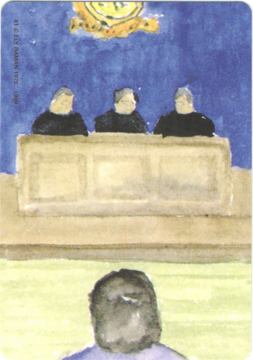
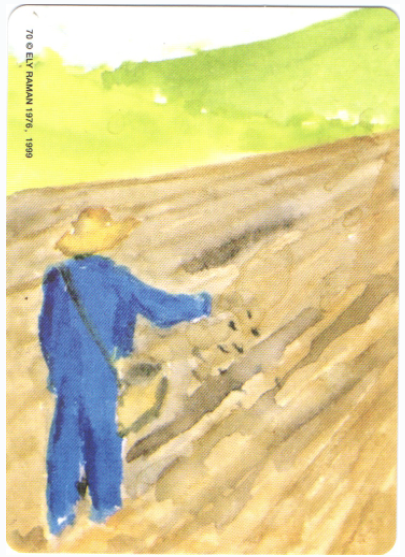
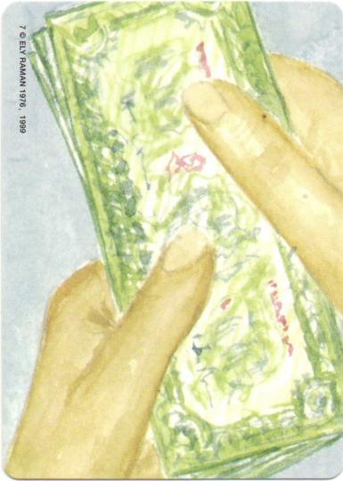
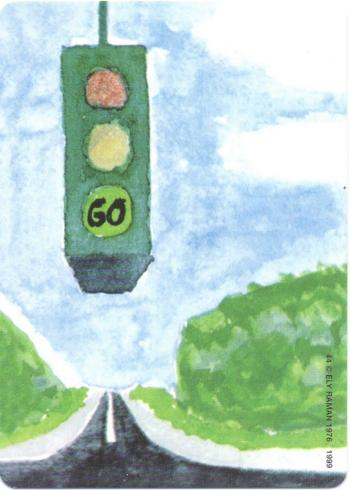

# From Left-Behind Child to Tech Expert: My Personal Growth Journey

Hello everyone, I am a child born in 1986 in a small mountain village in Nanchong, Sichuan.

What I want to share today is not a comeback success story, but a real memory of an ordinary person finding direction amidst difficulties.

The most vivid image in my memory happened when I was two or three years old.

That day, my mother went to the market. The family had just bought a few chicks — in that era, this was the family's only hope: when they grew up, their eggs could be exchanged for money, and selling them could pay off some debt.

But when she returned, the chicks had all been carried away by weasels.

She sat on a small stool in the room, holding her head, crying loudly.

That image, I still remember to this day.

Looking back, I now understand: poverty is a force that can make people collapse.

My father was a typical "extrovert" — outgoing, couldn't stay home, always wanted to go out and make his way. He said he was going out to "do business." But speaking of "doing business," he really wasn't cut out for it.

For example, around 2010, he acted as an agent for a type of instant water heater in Wenzhou, the kind you attach to a faucet and it produces hot water when plugged in.

He bought hundreds of units in one go, but in the end only sold a few dozen, several of which he gave away for free to relatives and friends.

You know what? After helping others install them for free, he was too embarrassed to charge money. How could you possibly make money like that?

In my childhood, my father was absent.

Farm work was almost entirely carried by my mother alone. Later, the family was deeply in debt, and my parents had to go out to work to pay it back, leaving my brother and me at my grandmother's house — we became "left-behind children."

What I remember most vividly is the day they left.

I wanted to go with them, crying and begging them to take me.

As a result, my eldest uncle locked me in the room.

That feeling of "crying to heaven with no response" — the inner despair and powerlessness — is still fresh in my memory.

The only thing I could do was push over the only basket of potatoes left in the room to vent my frustration.

## The Misunderstood Child: Why Do Adults Prefer to Believe Lies?

After becoming left-behind children, my brother and I lived with no sense of security.

Grandmother was illiterate and didn't care much about our studies. What was worse, getting from home to school required crossing mountains and ridges, a journey of over an hour on mountain roads.

Every day the situation was like this: we would get home from school, and grandmother would only then start cooking. After eating, we would go to school, almost certainly late. After being late several times in a row, we would be beaten by the class teacher.

I cried and explained to the teacher that grandmother cooked too late. Later, the teacher confronted grandmother. As a result, grandmother said there was no such thing, that we were late because we were playing on the way.

An adult, for the sake of face, could so easily deny a child's truth.

Why do adults prefer to believe the lies of adults rather than the tearful facts spoken by a child?

Of course, that day, my brother and I were beaten again.

## "Obedience" Under Violence: I'm Not Good, Just Afraid

A year later, my parents finally came back, and the debt was paid off.

But the good times didn't last. Economic pressure meant one of them always had to go out to work to make ends meet.

What was worse, when my father was home, he became addicted to gambling. This became the biggest nightmare of our childhood.

Once he lost money, his mood would become extremely irritable. If we did even the slightest thing wrong — especially making mistakes in our homework or not finishing it on time — we would be severely beaten by him.

I remember one time, he beat us so badly that even he felt it was excessive. Afterwards, with red-rimmed eyes, he said to us: "I will never hit you again, Dad promises."

At that moment, we really believed it. But it was just empty words.

Later, we were still beaten frequently. My brother was beaten the most. I wasn't better behaved, just more "sensible" — I knew that as long as I didn't resist, didn't talk back, didn't make mistakes, I could avoid one more beating.

It's not so much being obedient as learning to compromise out of fear.

I am also very grateful to my brother.

If he hadn't shielded me from my father's "rage" time and again, perhaps I would have been the one with the most scars.

## Junior High: In the Darkness, I Met the Light

By junior high, both parents were working outside, leaving my brother and me to depend on each other.

Every weekend, we had to walk home from school 5-6 kilometers away, cooking and doing laundry ourselves. What I'll never forget is that there was often no food at home, not even pickled vegetables. Basically, we just ate plain rice every time.

To save time, we would cook the rice the night before, and reheat it the next morning before going to school. Once, after reheating the rice and lifting the lid, I saw a cockroach as long as a thumb — southern cockroaches are really big! It had actually hidden in the rice to steal food!

There was no time to cook again, so my brother and I just toughed it out and ate it. Even now, I clearly remember the taste of eating cockroach leftovers. It was really quite something.

However, even in such a difficult environment, studying became a ray of dawn for me.

I ranked first in the entire grade in the high school entrance exam, and fourth in the entire county. This can be attributed to several important factors:

First, it was my father's beatings. (Laughs)

Don't worry, I'm joking.

My father's strictness (including those beatings) did to some extent push me to study hard.

But I must say: the fear brought by violence far outweighed any possible "grade improvement."

What it gave me was not motivation, but shadow.

So this "reason" had minimal effect and enormous side effects. Strongly not recommended.

What truly set me on an upward path was the power of role models.

In third grade, I had a cousin whose academic performance consistently ranked first in the grade.

Almost imperceptibly, I started learning from him to get up early to read, to do homework seriously, and even to preview lessons actively.

By fifth grade, I received first place in the grade for the first time.

The ancients said, "When weeds grow among hemp, they grow straight without support." This is the principle.

This made me deeply understand: parents being their best selves and setting good examples is far superior to thousands of verbal preachings.

In junior high, although life was still difficult, I met several teachers who changed the trajectory of my life: Teacher Wang Quanmin, Teacher Peng Changying, Teacher Deng Hui. They were the benefactors in my life.

Especially my class teacher, Teacher Wang Quanmin. He knew about my brother's and my situation and took extra care of me.

There is one thing I still remember vividly. Once in physics class, our principal personally came to teach, and the assignment was to draw magnetic field lines. After I finished drawing, the principal looked at my work and suddenly flew into a rage, saying my magnetic field lines looked "like cannon barrels," meaning they were too ugly, and made me kneel on the platform.

To be honest, I was quite wronged at the time. I had clearly drawn them correctly; it's just that my drawing style might have been rather... unattractive. The principal was probably just in a bad mood.

I knelt on the platform for about ten minutes. Teacher Wang happened to pass by the classroom and saw the situation. He immediately called the principal outside and said to him:

"This student's parents are both working outside. He and his brother depend on each other. His grades have always been among the top in the grade. Maybe he was just a bit careless. Please don't be too hard on him."

After hearing this, the principal immediately understood, returned to the classroom, and said to me: "Go back to your seat."

At that moment, I was truly moved. At the time when I most needed protection, he stood up decisively to speak for me.

Looking back now, although my family of origin had many flaws and my parents were often absent from my growth, the care given to me by those teachers in junior high became a major force on my path of life.

Precisely because of them, my studies went smoothly during junior high.

But in high school, I wasn't so lucky.

## High School: When the Light Went Out, I Fell into Darkness

After graduating from junior high, I got into the best high school in our county — Yingshan Middle School.

This school had 1-2 students admitted to Tsinghua or Peking University every year. In our small county, it was already a "top institution."

When I first entered, I was full of confidence.

In the first monthly exam of my first year of high school, I ranked sixth in the grade and second in the class.

In my first year, my grades were basically stable in the top 30 of the grade. But unfortunately, my class teacher did not give me the special care that my junior high teachers had.

The real turning point came in my second year of high school.

On one exam, I dropped from around 20th in the grade to over 180th. The reason was simple, yet also complex — I had developed test anxiety.

I believe many people have had this experience: clearly it was a very simple question, one you could normally get right easily, but during the exam, you inexplicably thought it was a difficult question, insisted on spending a lot of time pondering it, and ended up getting it wrong.

This is the terrible snowball effect. Once you start doubting yourself, thinking there are hidden tricks behind simple questions, you're basically finished.

After several exams, my self-confidence was completely destroyed. Every exam, I found it hard to finish all the questions, always feeling that time was insufficient, always feeling that every question had a trap.

The most crucial thing was that I couldn't find a way out of this predicament. Looking back now, if only I had known a bit of psychology back then. Because this is a typical anxiety disorder, and with the right methods, it can be resolved quickly.

But at the time, I was like having fallen into a quagmire, the more I struggled, the deeper I sank.

Even more chilling things were still to come.

My biology teacher, surnamed Hu, seeing my grades plummet, one day called me alone to the office and said a lot of encouraging words, things like "you have potential," "don't give up."

At that moment, I was truly moved inside, thinking: I've finally met another teacher who truly cares about me!

However, I was wrong.

The next monthly exam, I only scored a little over 70 in biology. I was really devastated at the time, and in a fit of anger, I threw the biology exam paper into the trash can.

He found out about the actual situation, and in front of the entire class, loudly berated me, made me stand up, and said I was "mud that won't stick to a wall."

At that moment, I felt deep humiliation and despair.

Actually, what I longed for deep inside was very simple — it was that unconditional love — not caring about me because my grades were good, nor disliking me because my grades were bad. What I needed was to be treated as a complete person, not just a report card.

I originally thought the biology teacher would be my savior; I didn't expect that what he cared about was only his own KPI.

From then on, the biology teacher never paid attention to me again. Every time he looked at me, there was contempt in his eyes.

That feeling of being completely abandoned really made me start to give up on myself.

I didn't know how to deal with my test anxiety, and there was no one willing to truly help me.

What was even more terrifying was that anxiety began to spread to other subjects.

My English was originally very good; in junior high, Teacher Peng taught me, and I was the best in the entire grade. But by my second year of high school, as soon as I heard English listening comprehension, I would inexplicably feel afraid, my mind going completely blank.

Those words that were originally familiar suddenly became strange during exams.

So, covered in scars and anxiety, I headed toward the college entrance exam.

In the end, during the 2005 college entrance exam, I only scored a little over 540 points, more than 10 points short of the cutoff for the second-tier universities.

From being first in the grade in junior high to failing the college entrance exam, this落差 was a huge blow to me.

As you can see, my high school experience is almost the complete opposite of the Rosenthal effect in psychology.

You may have heard of this famous psychology experiment —

At an elementary school in California, researchers conducted a "Harvard Test," claiming it could predict which students would have an "academic breakthrough" in the future.

They randomly selected about 20% of the students and told the teachers: "These children have great potential and will grow rapidly in the coming year."

In reality, these children were no different from the others.

But amazingly, a year later, these 20% "highly anticipated" students really did perform significantly better than their classmates.

The IQ test scores of lower-grade students improved by an average of 10%-15%, and upper-grade students also showed positive progress.

This is the power of teacher expectations: when you are believed in, you really do become better.

When a teacher believes a student can succeed, the student often really can; when a teacher thinks a student is mud that won't stick to a wall, the student really does fall into decline.

Now I often think, if I had learned about healing inner sub-personalities back then, if I had learned to unconditionally care for the child within, perhaps the outcome would have been completely different.

## Repeating a Year: Glowing in the "Darkness," the Second Wave of Benefactors in Life

After failing the college entrance exam, I was unwilling to give up just like that. I chose to repeat a year. There was an important turning point when choosing the school.

Choosing a school for repeating a year was a crucial decision. For most people, the better the school you choose for repeating a year, the higher the probability of success.

I had considered prestigious schools like Nangao and Mianyang Middle School. In the end, I chose Mianyang Middle School and went there alone for a two-day trial.

But that environment made me feel extremely oppressed. I saw the mountain of exam papers piled up on the desks of those repeating students, and the entire classroom was filled with a suffocating atmosphere of tension. My inner self began to intensely reject this environment, wanting only to escape.

What was more important was that my test anxiety symptoms had not disappeared; instead, they became more severe in this high-pressure environment.

On the second day at Mianyang Middle School, I decided to see a psychologist.

Including the registration fee, I spent 80 yuan — at that time, this was no small expense for me. But I was truly desperate, hoping to find a way out of the predicament.

However, that psychological consultation was a great disappointment.

That doctor just sat there listening to me talk, and after an hour, he told me: "Come back next time."

I thought to myself at the time: Aren't you just scamming money? It's so expensive, yet you didn't give me any实质性 help. Maybe he himself had never taken the college entrance exam and completely couldn't understand the immense pressure inside the hearts of us high school students.

Wanting to regain my former confidence through one psychological consultation was indeed too difficult.

After the consultation ended, I returned to school. The class teacher asked me where I had been, and I truthfully said I had gone for psychological counseling.

Unexpectedly, he actually said: "You must have gone to look at other schools for repeating a year."

I was really speechless at the time. Even the truth wasn't believed, which made me feel even more lonely and misunderstood.

In the end, I decided to leave Mianyang Middle School.

Not because the school was bad, but because that environment was too oppressive for me. What I needed was not more pressure, but understanding, support, and the right methods to deal with my psychological problems.

So I came to Nanchong Gaoping Middle School. There was only one class for repeating a year, no "Tsinghua and Peking University seedlings," no countdown slogans covering the walls.

It was very ordinary, but very quiet.

It was precisely this "non-competitive" atmosphere that gave me a chance to breathe and be reborn.

At that time, one sentence kept echoing in my mind:

"If you are a candle, learn to shine in the darkness, because only in the darkness is your light most valuable."

This sentence woke me up:

A chicken placed among cranes will only be drowned out; but if placed in a suitable environment, it can instead make a resounding crow.

I didn't need to prove that I deserved the label "top" anymore.

I just needed a place where I could grow with peace of mind.

To piece back together the shattered self, bit by bit.

Here, I would meet several other benefactors in my life — they were not just teachers, but more like psychotherapists, helping me regain the peace and strength within my heart.

Teacher Yue Bo taught me mathematics and had a particularly great influence on me.

The first time I took a math exam, I only scored 118 points, with several low-level mistakes. Teacher Yue was very strict, but his strictness was methodical.

He often said to us: "Do you know who grades the college entrance exam papers? They are graduates from normal universities, and they are paid by the number of papers they grade. If your answer is not correct, no matter how good the process is, it's zero points. I might still give you points for the process, but in the college entrance exam, you might not be so lucky."

Teacher Yue's favorite phrase was: "Don't be 'two-not-hanging-five'!"

Do you know what "two-not-hanging-five" means? It means "two hundred and fifty," referring to being reckless and careless. This phrase made me understand the importance of paying attention to details.

More importantly, Teacher Yue taught me a lot of top-level thinking about dealing with math exams. He taught me to look at problems from the perspective of the question setter, thinking about what the question setter wants to test and where the traps are set.

This kind of thinking not only helped my math grades but also influenced my later judgment. For example, now when I see some emotionally manipulative articles online, I will think about the true purpose of the article, what the author ultimately wants to achieve, and which facts they deliberately emphasize or ignore. This allows me to view things more objectively and rationally.

In the end, in the college entrance exam, I scored 122 points in math. You should know that year's math exam was particularly difficult; only 4 people in our school scored above 120 in math.

My biology grades were not very good; every exam I was just above average. But that female biology teacher, surnamed Peng, was very kind to me.

She was always very patient in answering my questions. Sometimes when I couldn't quite grasp something, she would even jokingly call me "Mangwa," as if I were her own child.

This unconditional love gave me great strength within. Because I knew that no matter how well or poorly I did in biology, the teacher would never abandon me. What she cared about was not my score, but me as a person.

This formed a sharp contrast with that high school biology teacher. One disliked me because of my poor grades; one treated me warmly regardless of my grades.

After a year of hard work repeating a year, I finally welcomed the turning point in my life.

During the college entrance exam, the first Chinese language exam gave me a small blow — I only scored a little over 90 points. To be honest, I felt a bit down at the time, because my original goal was Huazhong University of Science and Technology.

But the experience of repeating a year taught me how to adjust my mindset. I didn't let the setback of the first subject affect my performance in the subsequent subjects; all other subjects were relatively normal.

In the end, I was admitted to the University of Electronic Science and Technology of China. Although I didn't reach my initial goal, this was already a very good result.

Looking back on my junior high and high school experiences, I want to share the most core insight with everyone:

Unconditional love is the source of a person's inner strength.

When Teacher Wang Quanmin, Teacher Yue Bo, and the female biology teacher gave me unconditional support, how lucky I was. Because they made me feel that my value did not depend on my grades, but on me as a person. This unconditional acceptance gave me enormous inner strength.

To use Buddhist terminology, at that time I was still in the stage of "being ferried by the teacher when lost" — needing external teachers to enlighten and save me.

And truly achieving "self-ferrying by one's own nature" — relying on one's own inner strength to face the ups and downs of life — came after I later studied psychology and Zen philosophy.

This is a process from seeking externally to seeking internally, from depending on others' affirmation to building an internal system of self-confidence. This transformation had a profound impact on my later life.

When I first entered university, I studied electronics. The seniors all said that our electronics major had no future, and the employment prospects were not good. But at that time, I only had a simple belief:

Do well in your studies, and work will follow naturally.

No matter what others thought, no matter what the outside world said, I firmly believed in this. This attitude of focusing on the present and focusing on what I could control allowed me to maintain a very good learning state throughout my four years of university.

I remember that in my sophomore year, I set a clear career planning goal for myself:

- Annual salary of 100,000 after undergraduate graduation (at that time, the best offer for our class was indeed around 100,000)
- Annual salary of 200,000 after master's graduation
- Annual salary of 300,000 after doctoral graduation

I calculated: a doctorate takes two more years than a master's, but the annual salary can be 100,000 higher. From the perspective of return on investment, the cost-effectiveness is quite good.

So I made a decision: pursue a doctorate!

This decision changed the trajectory of my life. I successfully obtained a guaranteed admission to the Chinese Academy of Sciences for graduate studies, and later continued to pursue a doctoral degree.

After graduating with my doctorate, I joined Alibaba. The first year's annual salary was 288,000, not far from the 300,000 goal I had set for myself.

Now, after nearly 10 years of work, I have grown step by step from a junior programmer to a technical expert.

This process was not easy. During this time, I also encountered many challenges:

- Technology updates very quickly, requiring continuous learning
- Work pressure is high, often working overtime late into the night
- Need to shift from pure technical thinking to technical management thinking
- Need to learn to lead teams and cultivate subordinates

But from the perspective of technical growth, I am very satisfied with myself.

## From "Being Ferried" to "Self-Ferrying": Code Can Be Refactored, and So Can Life

In 2017, an important turning point came in my life — my daughter was born.

When I first held that little life weighing less than 3 kilograms, her tiny hand gently grasping my finger, my heart was filled with endless responsibility and joy. At that moment, I suddenly understood what it means to "become strong for one's child."

Looking at her clear eyes, a unprecedented longing surged within me: how I wanted to tell her the truth of this world, to let her understand the mysteries of the universe and the meaning of life, to impart to her the wisdom of life.

But facing this little life, I found myself full of doubts and uncertainties. I didn't know how to explain this complex world to her, nor did I know how to answer those profound questions she would ask in the future.

As a technical person, I was used to finding answers when encountering problems, and debugging when encountering bugs. But faced with the most complex "system" of life, I realized that I needed deeper wisdom.

So, I made a decision: to figure out these questions about life and wisdom.

This was not just for myself, but also to be able to give my daughter a better answer and become a true guide on her life path.

I began a "cross-disciplinary debugging":

I studied psychological healing techniques with the Ericksonian hypnosis master. This made me understand how to "debug" the bugs in other people's hearts — those traumas, fears, and limiting beliefs, just like logic errors in code, can be identified, understood, and fixed.

Through studying psychology, I was not only able to better understand others but also to more profoundly understand myself. Those childhood traumas, the roots of that test anxiety, became clearly visible within the framework of psychology.

I studied Zen meditation with Thich Nhat Hanh, which taught me how to keep my inner system running stably.

Zen meditation is like doing system optimization for the mind — clearing garbage emotions from memory, shutting down negative thinking processes running in the background, allowing the entire psychological system to run more smoothly and efficiently.

In this exploration process, I compiled and wrote this book, *The Complete Wisdom*.

Programmer friends all know a classic question: if you could only bring one book to a deserted island, what would you bring?

The standard answer is *Code Complete* — because it covers almost all the core wisdom of programming, the Bible-level work for programmers.

I chose the name *The Complete Wisdom* in the hope that it would become the "Code Complete" for life programming.

No matter what stage of life you encounter a bug in, no matter what malfunction occurs in your psychological system, opening this book, you can find the corresponding "debugging plan" and inner strength.

After all, code can be refactored, and so can life. And wisdom is the best debugging tool.

## Two Things I Want to Teach My Child: Wisdom and Making Money

As a father, I hope to impart two of the most important life skills to my daughter: wisdom and wealth, the former being inner strength, the latter being ability.

Regarding the question of wisdom, through years of study and practice, I already have some preliminary answers. In addition to wisdom, I also want to teach my child how to make money. Regarding this second question — how to make money and manage wealth — this is also an area I am currently deeply exploring. I hope that in the future, I can give myself, and also my daughter, a satisfactory answer.

Looking back on this journey:

From the left-behind child locked in the room crying,

To the high school student haunted by test anxiety,

To the lost repeater after failing the college entrance exam,

To a Ph.D. from the Chinese Academy of Sciences, an Alibaba technical expert, a father, and the author of *The Complete Wisdom*...

I finally understand:

They have taught me —

True education is unconditional love;

True growth is not becoming what others expect, but learning to piece yourself back together again and again after shattering.

Thank you, everyone.

---

# 8. OH Cards Application: "Why Don't I Like Money?"

In our lives, wealth is often seen as a symbol of success, but for some people, it may carry complex emotions and memories, even leaving difficult-to-heal wounds in the subconscious. OH Cards, as an intuitive and profound psychological tool, can help us touch those forgotten, suppressed, or unwilling-to-face true feelings, especially those early life imprints tightly intertwined with money, love, and survival, thereby opening the possibility of self-awareness and healing.

## A Case: Why Don't I Like Money?

The client, Hu Yufei, 32 years old, is an ordinary office worker. He came for counseling with a seemingly simple yet profoundly meaningful confusion: "I don't seem to want money that much, even a bit dislike it."

Unlike most people's desire for wealth, Hu Yufei lacks a strong motivation to make money, and even carries a faint resistance in his heart. Whenever the topic involves wealth, he always feels an indescribable heaviness.

This complex emotion puzzles Hu Yufei. He hopes to find the root of this special attitude and uncover the truth buried deep within.

## The OH Cards Exploration Process

Hu Yufei used OH Cards in counseling, with "wealth" as the core theme, to deeply explore his complex emotions and inner beliefs about money. The entire exploration process is divided into the following steps:

### (1) Setting the Intention

Before officially beginning, Hu Yufei clarified the core question he wanted to answer: "Why do I lack a strong desire for money? What exactly is hidden behind this attitude?"

### (2) Choosing Keyword Cards

After careful consideration, he selected two keyword cards with contrasting meanings:

- "Cold": Precisely capturing his current true feelings about wealth — alienation, resistance, and even a certain defensive indifference.
- "Warm": Symbolizing the ideal state he deeply longs to achieve — establishing a healthy, natural relationship with wealth.

### (3) Drawing Situational Cards and Interpreting Them

"Cold" corresponded to: a picture of a person being "interrogated."

"Warm" corresponded to: a picture of a person sowing seeds in a field.

### (4) Deep Association and Self-Narration

Hu Yufei gazed at the cards, and the door to long-sealed memories was slowly pushed open. A deeply buried story of trauma about money and love gradually unfolded:

> "When I was 13, my father died suddenly of a heart attack. Not long after, my mother remarried. My grandparents and my mother already had conflicts, and now the conflicts in the entire family escalated completely.
> During that time, the whole house felt extremely cold. Everyone's face seemed frosted over, with no smiles at all. The gossip in the village and the quarrels among relatives flooded me like a tide.
> Because of my father's death, we were in extreme financial difficulty. I lived with my grandparents, and even the cost of going to school became a problem. Someone in the village suggested that I sue my mother in court to make her pay child support.
> When I heard this suggestion, I felt extremely uncomfortable — how could a child sue their own mother? But at that time, looking at my grandparents at such an advanced age, the family was indeed in too much difficulty. For the sake of my grandparents' livelihood and my own tuition, I ultimately chose to acquiesce.
> The scene in court that day is something I will never forget in my life. My grandparents, my second uncle, my mother, my maternal uncle, and her new man all went. The atmosphere was as cold as an ice cave. Everyone was quarreling, anger, helplessness, loneliness, all kinds of emotions pressing down on me so hard I couldn't breathe.
> What hurt me most was that that man was actually wearing the cotton-padded jacket my father had bought before he died. That jacket was a new one my father bought with my mother at the market when he was still alive. My father himself had never even worn it. Seeing that man wearing it, I completely broke down. I rushed up and roared angrily at him, telling him to take the clothes off!
> At that moment, I cried my eyes out, feeling like I had been abandoned by the whole world......
> That lawsuit, for me, was not a process of solving a problem, but a battlefield tearing apart family affection. The relatives around were all confronting each other, like stabbing each other with knives.
> Later, one time, my mother came to school to see me. After coming back, my mood was very complex — I missed her, but I also hated her. During dinner, Grandpa saw that I was unhappy and yelled at me, calling me a traitor. I couldn't take it, ran out along the pitch-black road at the head of the village, roaring wildly, venting all my anger and grievances.
> At that time, no one listened to me. I could only shout to myself. How I wished my family could reconcile, that everyone loved me......
> From then on, I developed an almost crazy obsession with studying. I studied like my life depended on it, until one or two in the morning. In winter, when the water tank froze over with ice, and I was sleepy, I would break the ice, scoop out the ice water to soak my feet, freezing myself awake. I also slapped myself wildly, ate chili peppers, did horse stance... using all kinds of methods to torment myself, just to stay awake, to study, to be first in the class.
> I now understand that studying like my life depended on it back then was actually an escape — the house was too chaotic, people's hearts were too complicated, I didn't want to face it. I thought that as long as I did well in school and got recognition, I could get more love, and prove that my efforts were worth it.
> But in reality, I was all using a form of self-abuse to anesthetize myself, avoiding that deepest wound."

When mentioning the "warm" card, Hu Yufei's tone obviously softened:

> "This picture of the field reminds me of when I was little, when my parents were still around, and our whole family would go to the market, passing through fields like that. At that time, the sunshine would pour down, especially warm.
> What I really want is not money, but that feeling of being surrounded by love. But later, money became the fuse of the family's fighting, and I felt it was so cold, so far from the warmth I wanted."

## Deep Reflection: The Root of Wealth Beliefs

Through OH Cards, Hu Yufei clearly saw: that childhood battle and lawsuit over money firmly tied "money" together with painful experiences of "fighting, coldness, tearing apart, betrayal." Money no longer symbolized safety and abundance, but instead became a trigger for trauma. "Until today, I realized that many of my thoughts about money and about love are continuations of that childhood. In my subconscious, I have always equated money with harm. And my rejection of wealth is precisely an attempt to escape that original pain."

## Healing and Action: Embracing the Wounded Inner Child

Under the gentle guidance of the counselor, Hu Yufei slowly closed his eyes and began a deep dialogue with his inner child — that child struggling forward carrying a huge block of ice, that child curled up in a dark corner crying alone, that child who both deeply loved and resented his mother......

He gazed at that wounded 13-year-old boy deep within his heart. Tears gushed out like a bursting dam, his voice choked: "Baby, I'm sorry, I'm sorry... I was wrong, baby, really sorry, I didn't take good care of you." The accumulated nineteen years of coldness, anger, loneliness, helplessness, and despair finally received true witnessing and release at this moment.

As the emotions were released, Hu Yufei's awareness became increasingly profound: "Seeing these images, I truly realized that all these years I have been living with these wounds. They keep reappearing, not to make me suffer, but to remind me — to see them, to heal them."

In the later stages of healing, Hu Yufei began to re-examine the past from a broader and more compassionate perspective: "I finally discovered that those quarrels, that lawsuit, and even those embarrassing conflicts — everyone's starting point was essentially not malicious. My grandparents sued my mother because they wanted me to live better; my mother had no job, and her choice to remarry was also to find a support for herself and me, hoping to take on my living expenses; even those people in court, they also wanted to help me solve practical problems through legal means." His voice became calm and deep. Understanding is not complete agreement, but this understanding brought an unprecedented sense of relief.

After this exploration, significant changes occurred in Yufei's life: his view of money completely changed. Money was no longer synonymous with pain and fear, but became a neutral resource full of possibilities. He no longer deliberately avoided or rejected it; he regained his lost inner strength, an unprecedented confidence welled up, feeling whole and solid; his action power greatly improved, and he began to actively face life, rewarding his own "rebirth" with dance and flowers, proactively communicating with his mother and grandmother, and family relationships became unprecedentedly harmonious.

What is most touching is that Hu Yufei learned to deeply embrace himself: "I really admire myself — I survived, I wasn't knocked down by those setbacks! I feel like I've truly been reborn." This deep respect and heartfelt praise for his own vitality became a powerful driving force for him to continue moving forward, and also witnessed the true awakening of a soul.

## Conclusion

From this case, we see that love and money are not inherently opposed, but can be harmoniously unified.

Each of us has a wounded child in our hearts, and also possesses a wise healer.

OH Cards are just a medium. The real magic comes from the courage within us — to see, to feel, and to embrace that imperfect yet real self.

When we learn to reconcile with our own trauma, we can achieve true inner freedom; when we reintegrate the split parts, we can embrace the wholeness and abundance of life.

---

# 9. OH Cards Application: From Anxious Child to Seeing Oneself

In the fast-paced life, we often direct our gaze outward — children's grades, partner's attitude, work pressure, social competition. We try to change others, control the environment, plan the future, as if as long as everything outside goes as wished, the heart can be at peace. However, when anxiety, worry, and powerlessness constantly emerge, have we ever stopped to ask: Is the source of these emotions really an external problem?

OH Cards are like a mirror to the subconscious — they don't judge, nor do they guide, they simply quietly reflect the most authentic voice within us. They gently invite us to withdraw from the obsessive "control" of the external world and turn toward inner awareness and listening. In those seemingly vague, even chaotic images, we may instead see those self-needs that have long been ignored, suppressed, or misunderstood.

## A Case: A Father with a Million-Yuan Annual Salary, Why Can't He Sleep at Night?

The client, Mr. Lin, is a Huawei technical expert about to retire. He has an enviable career resume — over a decade of deep technical expertise, with an annual salary of one million yuan. However, recently he has been frequently suffering from insomnia, his anxiety revolving around a core theme: his son who is about to start elementary school.

During our counseling sessions, he repeatedly mentioned: "Society is too competitive now, the competition is too fierce... What I fear most is that my child won't have a foothold in society in the future." On the surface, this is typical "parenting anxiety" — fear of educational competition, worry about the child's future.

He picked two cards from the OH Cards keyword cards, pointing to his "current state" and "ideal state" respectively:

- "Worry": Mapping his anxiety about his child's future.
- "Freedom": He candidly admitted that what he truly wants is to be able to travel freely after retirement, to visit mountains and waters.

The situational cards drawn:

(1) "Worry" corresponded to: a picture of "hands holding banknotes"

(2) "Freedom" corresponded to: a picture of "driving on a trip"

## Mr. Lin's Associations and Interpretations

### (1) "Worry" + "Hands Holding Banknotes"

Seeing those hands tightly gripping the banknotes, Mr. Lin's eyes tightened: "This is what I fear most — having no money. I'm afraid my child will be restricted everywhere like I was as a child due to having no money." He recalled his childhood: an ordinary family background, where even buying a decent extracurricular book required saving pocket money for a long time. That feeling of "wanting but unable to have" powerlessness was deeply imprinted in his heart. He said he worked desperately, not just for success, but to escape that sense of insecurity.

He further shared: "Actually, I'm not worried about whether my child 'can make money,' but rather afraid that 'I can't teach' (how to make money for the child), 'I can't provide.' At Huawei, a million-yuan annual salary is my security anchor. Once I leave, can I still replicate this ability?"

This year he is about to turn 45, facing the common "retirement line" at internet giants. Seeing his career entering the countdown, with income about to drop off a cliff, he began to repeatedly ask himself: "How much further can I pave the way for my child? Will he have the ability to stand firm in this world in the future?"

I asked him: "If you could still earn a million yuan a year after retirement, would you still worry about your child?"

"No." Speaking of this, he suddenly realized: "I always thought I was anxious for my child, but actually... I'm anxious about myself. I'm afraid I won't be able to 'support' the family and raise the child well after retirement. And the deeper anxiety is — can I still do it?"

### (2) "Freedom" + "Driving on a Trip"

This picture made his eyes slightly red: "This is what I truly want — to leave a large sum of money for my family, and then go traveling alone. With a backpack, walking in the mountains, no KPIs, no annoying meetings, no pressure of 'must succeed.'"

## Deep Reflection: The Source of Anxiety Is the Unsettled Self

Through the layer-by-layer reflection of OH Cards, Mr. Lin gradually realized: those seemingly deep worries about his son's future essentially stem from his own fear of "uncertainty after retirement." He tries to tightly control his child's growth trajectory — expecting excellent grades, a successful career, independence and self-improvement — actually trying to compensate for the deep insecurity within himself.

Mr. Lin's case reveals a deep psychological issue: when our sense of self-worth is excessively anchored to professional identity and economic income, facing the turning points of life easily produces a strong identity crisis and existential anxiety. This singular value dependency causes us to instinctively activate "control mode" when encountering uncertainty — trying to gain a substitute sense of security by controlling others' (such as children's) life trajectories.

## Action Plan

Mr. Lin formulated a clear identity transformation plan: shifting from an "executor" dependent on a single high-salary position to an "enabler" building a diversified capability system.

He plans to transform the technical experience and cognition accumulated at Alibaba and Huawei into productizable knowledge services, targeting technical people with 1-5 years of experience, providing systematic content covering technology trends, project reviews, growth mindsets, and career cases.

The entire transformation will be steadily advanced in three stages: first, completing positioning and content planning; second, accumulating target users through graphic and video content; and finally, launching micro-courses to form a business closed loop of "free content — low-price products — high-end services."

After formulating these specific transformation plans, Mr. Lin obviously felt changes within. The anxiety caused by purely relying on his position began to weaken. He no longer focused his attention on excessive concern for his son's academic performance, but instead invested more energy into his own capability building and content creation. This shift in mindset not only made his family relationships more harmonious but also injected new vitality and possibilities into the latter half of his career that he was about to face.

## Conclusion

Our reactions to the outside world are often the true reflection of our inner world. When we are excessively anxious about our children's academic performance, it may be precisely because we cannot accept that part of ourselves that was once "not good enough"; when we are frequently disappointed with our partners, it may be because that self deep within that longs to be completely understood has never been truly seen and comforted.

Just as Mr. Lin discovered through OH Cards — on the surface, it is worry about his son's future, but in reality, it is fear of his own imminent loss of economic security. We often think we are thinking of others, but we do not realize that the roots of those emotions actually point to that unsettled self within.

As the saying goes: "The world is a mirror of the heart; all relationships ultimately return to the self." When we learn to reconcile with our own unease and fear, learn to construct our self-worth from multiple dimensions, we can stop seeking security from the outside and instead become our own most reliable support.

---

## Qidian Book Club, Reader Q&A Column

The following content is excerpted from the Qidian Book Club "Reader Q&A Column."

